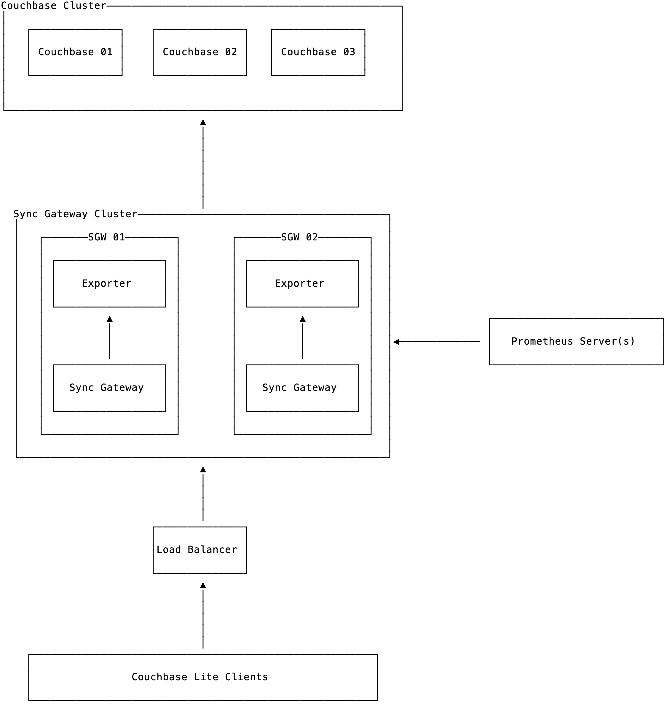

# couchbase-sync-gateway-exporter

A [Prometheus][] exporter for [Couchbase Sync Gateway][sgw].

---

An usual deployment would look similar to the following:



In that image we have:

- a couchbase server cluster
- several sync gateway instances
- one couchbase-sync-gateway-exporter running for each sync gateway instance
- a load balancer
- clients talking to sync gateway instances through the load balancer

The exporter uses Sync Gateway's admin port to gather metrics, and that port
binds only to `localhost`. On the other hand, this exporter binds by default
to `0.0.0.0`. You can change that using `--web.listen-address` flag. You can
also secure it using firewall/VPC.

That being said, the Prometheus instance should then gather metrics from all
the exporter instances. You can achieve that by just listing all endpoints
there or by using [service discovery][sd-config]:

```yaml
scrape_configs:
  - job_name: swg
    static_configs:
    - targets:
      - sgw01.foo.local:9421
      - sgw02.foo.local:9421
      - sgw03.foo.local:9421
```

That's pretty much it.

<!--
TODO:
- add grafana
- add alerts
-->

[Prometheus]: https://prometheus.io
[sgw]: https://www.couchbase.com/products/sync-gateway
[sd-config]: https://prometheus.io/docs/prometheus/latest/configuration/configuration/
